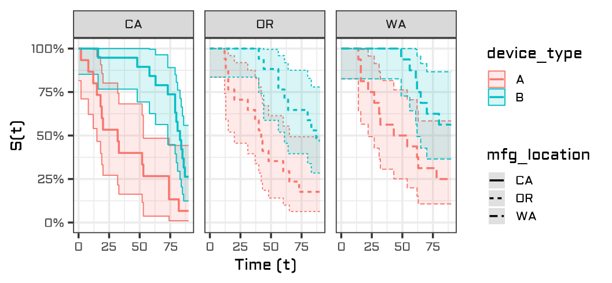
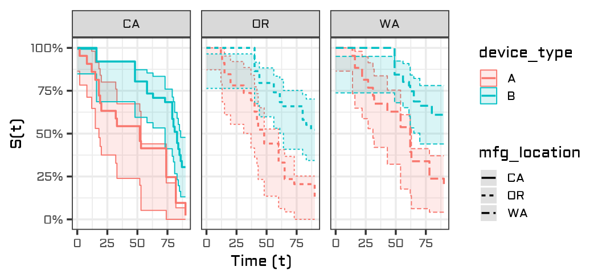
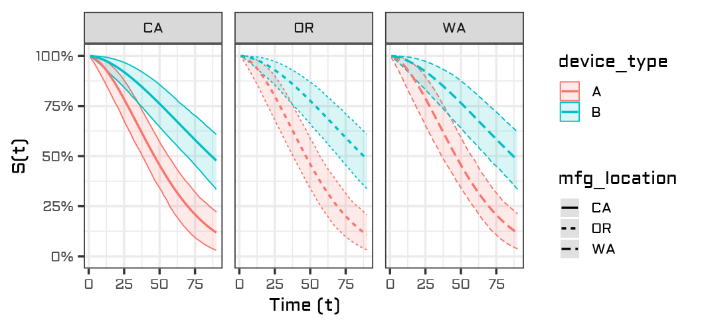
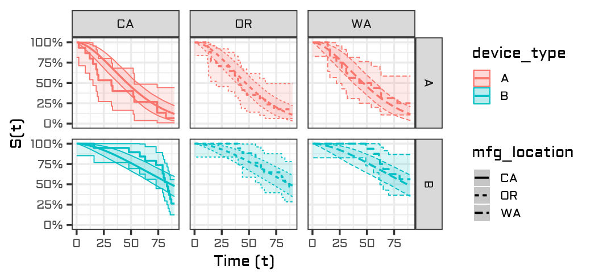
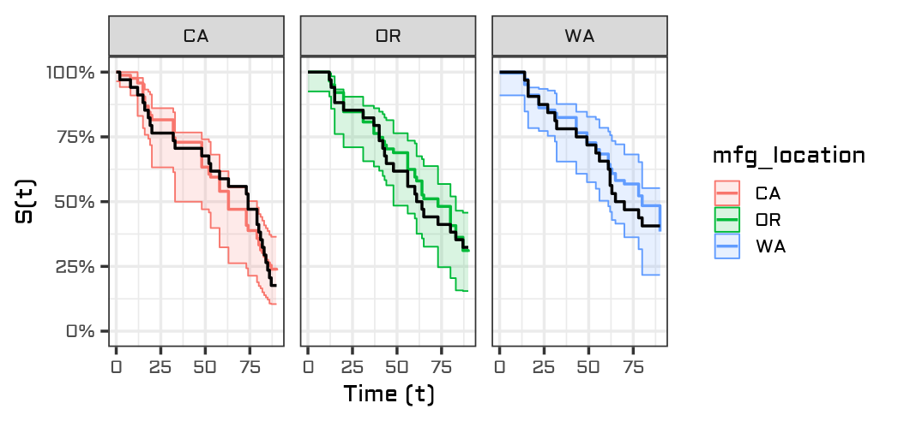
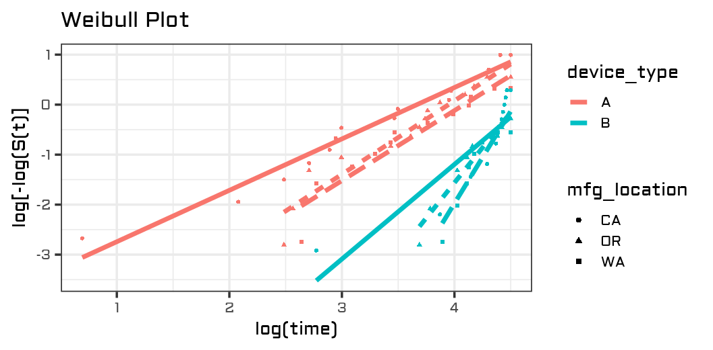
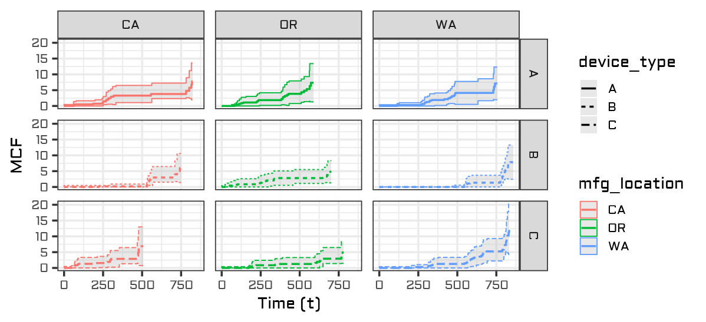

<!-- README.md is generated from README.Rmd. Please edit that file -->

```{r, include = FALSE}
knitr::opts_chunk$set(
  collapse = TRUE,
  comment = "#>",
  fig.path = "man/figures/"
)

library(tidyverse)
library(usethis)
library(pkgdown)
library(survival)
library(devtools)
library(showtext)
library(broom)
library(rlang)
library(flexsurv)
library(ggnewscale)


font_add_google("Aldrich","aldrich")
showtext_auto()
theme_set(theme_bw(base_family="aldrich", base_size=14))

load_all("/cloud/project/surviveR")

```

# surviveR

```{r, echo = FALSE, out.width = "40%", fig.align = "center"}

```

The surviveR package is a reliability and survival data visualization tool that leverages the user-friendliness of the Tidyverse ecosystem. Functions in surviveR allow users to specify time-based aesthetics alongside standard non-aesthetic arguments to generate highly customizable graphs. 

<!-- badges: start -->

<!-- badges: end -->

## Installation

The `surviveR` package is currently under review for inclusion in the CRAN repository. In the meantime, you can install the development version of `surviveR` via one of 2 methods--the remotes package (probably the easiest) or downloading the files directly from the GitHub.

### Option 1: the remotes package (if you already have a Github account)

```{r}
# install.packages("remotes")
# 
# library(remotes)
# 
# remotes::install_github("KLGORE/surviveR")
# 
# library(surviveR)
```

### Option 2: Download directly from GitHub

If downloading the package files directly from GitHub, please follow these steps:

1.  Click on (this link)[<https://github.com/KLGORE/surviveR>] and and download all package files into a folder on your computer.

2.  Open up an R session and set your working directory to the path to the folder that contains all of the package files.

3.  Make sure the following packages are installed and loaded on your computer: tidyverse, devtools, survival, and flexsurv. (I'm reasonably sure these get automatically installed and loaded with the installation, but if you run into issues installing the package, try loading those packages and try again.)

4.  Run `load_all()` in your console. Then you should have full access to the wonders of `surviveR`!

## Package contents

The current version of `surviveR` features data visualizations for the following survival plots:

-   Kaplan-Meier (KM) plot

-   Cox Proportional Hazards (CoxPH) plot

-   Parametric survival plot

-   Weibull plot

-   Mean Cumulative Function (MCF) plot

Users may specify whether they want to visualize the survival probability or cumulative failure probability in the arguments.  Additionally, each geom_[fill in the blank] comes in 2 "flavors"--one in which the user specifies the time and grouping variables in the aesthetics mapping and one in which they are specified via a survival formula.  

## Sample datasets

This package features two pre-loaded simulated datasets--`mfg` and `device_repair`.

The `mfg` dataset contains data from a fictional reliability pilot study in which 150 customers receive one of two device types ("A" or "B").  The manufacturing location of each device is recorded in the `mfg_location` variable ("CA", "OR", or "WA").  The time to failure `ttf` variable is the time variable of interest.  Values of 1 in the `status` column indicate no censoring, whereas values of 1 indicate right censoring.

The `mfg` dataset is used to demonstrate capabilities of the `geom_km`, `geom_coxph`, `geom_survreg`, and `geom_weibull` functions.

```{r}
head(mfg,20)
```

The `device_repair` dataset showcases fictional multi-event data for a fictional device.  The `device_id` column contains unique identifiers for each device, with the repair_time column indicating the time in which an event (failure or device retirement) occurred.  *Regardless of the presence of a status column*, the maximum event time for each device_id is assumed to be the censoring time for the device.

The `device_repair` dataset is used to showcase the capabilities of `geom_mcf`, which visualizes the mean cumulative function (MCF) for repairable systems.

```{r}
head(device_repair,20)
```


## Survival functions

The following sections provide a preview of the capabilities of the `surviveR` package.  Each subsection contains examples for how to generate the same plot by specifying variables through the aesthetics mapping or a formula.  

For more details, please reference the documentation.

### Nonparametric: Kaplan-Meier curves

#### geom_km

```{r}
my_plot=
mfg %>% 
     ggplot() +
     geom_km(aes(time = ttf, time2 = status, treatments = device_type, strata = mfg_location)) +
     facet_grid(.~mfg_location)
```

#### geom_km2 (formula-based input)

```{r}
my_plot=
mfg %>% 
     ggplot() +
     geom_km2( Surv(ttf, status) ~ device_type + strata(mfg_location) ) +
     facet_grid(.~mfg_location)
```


Resulting plot:
```{r, echo = FALSE, fig.width = 12, fig.height = 7.5, out.width = "80%", fig.align = "center"}

```


### Semiparametric: Cox Proportional Hazards curves

#### geom_coxph

```{r}
my_plot=
mfg %>% 
     ggplot() +
     geom_coxph(aes(time = ttf, time2 = status, treatments = device_type, strata = mfg_location)) +
     facet_grid(.~mfg_location)
```

#### geom_coxph2

```{r}
my_plot=
mfg %>% 
     ggplot() +
     geom_coxph2( Surv(ttf, status) ~ device_type + strata(mfg_location) ) +
     facet_grid(.~mfg_location)
```


Resulting plot:
```{r, echo = FALSE, fig.width = 12, fig.height = 7.5, out.width = "80%", fig.align = "center"}

```

### Parametric regression curves

#### geom_survreg

```{r}
my_plot=
mfg %>% 
     ggplot() +
     geom_survreg(aes(time = ttf, time2 = status, treatments = device_type, strata = mfg_location)) +
     facet_grid(.~mfg_location)
```

#### geom_survreg2

```{r}
my_plot=
mfg %>% 
     ggplot() +
     geom_survreg2( Surv(ttf, status) ~ device_type + strata(mfg_location) ) +
     facet_grid(.~mfg_location)
```


Resulting plot:
```{r, echo = FALSE, fig.width = 12, fig.height = 7.5, out.width = "80%", fig.align = "center"}

```

### Overlaying Fits

#### Layers with aesthetics mapping

```{r}
my_plot=
mfg %>%
    ggplot() +
    geom_survreg(
     aes(time=ttf, time2=status, trt=device_type, strata=mfg_location)
    ) +
    geom_km() +
    facet_grid(device_type ~ mfg_location, scale="free_x")
```


Resulting plot:
```{r, echo = FALSE, fig.width = 12, fig.height = 7.5, out.width = "80%", fig.align = "center"}

```


#### Layers with formulas

```{r}
my_plot=
mfg %>%
    ggplot() +
    geom_coxph2(Surv(ttf,status)~mfg_location) +
    geom_km2(color="black", conf.int=F) +
    facet_grid(.~mfg_location)
```


Resulting plot:
```{r, echo = FALSE, fig.width = 12, fig.height = 7.5, out.width = "80%", fig.align = "center"}

```

### Other

#### Weibull plots

```{r}
my_plot=mfg %>% 
     ggplot() +
     geom_weibull(aes(time = ttf, time2 = status, treatments = device_type, strata = mfg_location))
```


Resulting plot:
```{r, echo = FALSE, fig.width = 12, fig.height = 7.5, out.width = "80%", fig.align = "center"}

```

#### Mean Cumulative Function (MCF) Plots

```{r}
my_plot=
device_repair %>%
    ggplot()+
    geom_mcf(
        aes(time = repair_time, ids = device_id, trt = mfg_location, strata = device_type),
        conf.fill = "gray", conf.alpha = 0.35) +
    facet_grid(device_type~mfg_location)
```


Resulting plot:
```{r, echo = FALSE, fig.width = 12, fig.height = 7.5, out.width = "80%", fig.align = "center"}

```

## In the works

The following functions are in varying stages of development:

*   geom_event - for visualizing event plots (was previously available, but we decided to take it offline to make changes to the layering scheme)

*   geom_ALT_temp - for visualizing Arrhenius-accelerated data from accelerated life tests (ALT's)

*   geom_ALT_volt - for visualizing voltage-accelerated data from accelerated life tests (ALT's)

Stay tuned!
